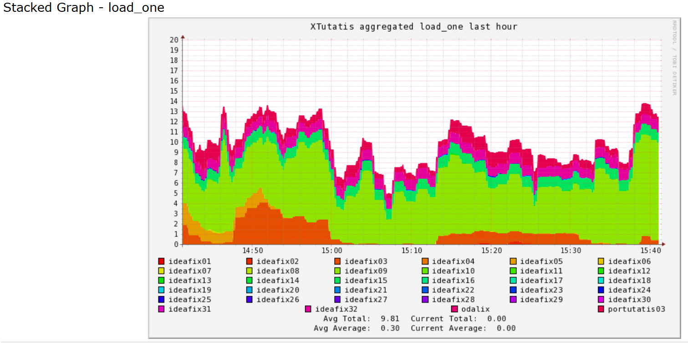
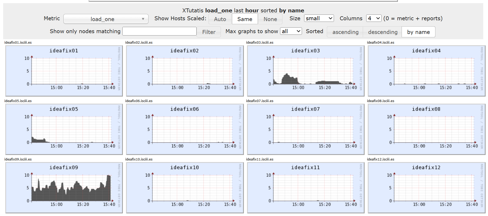
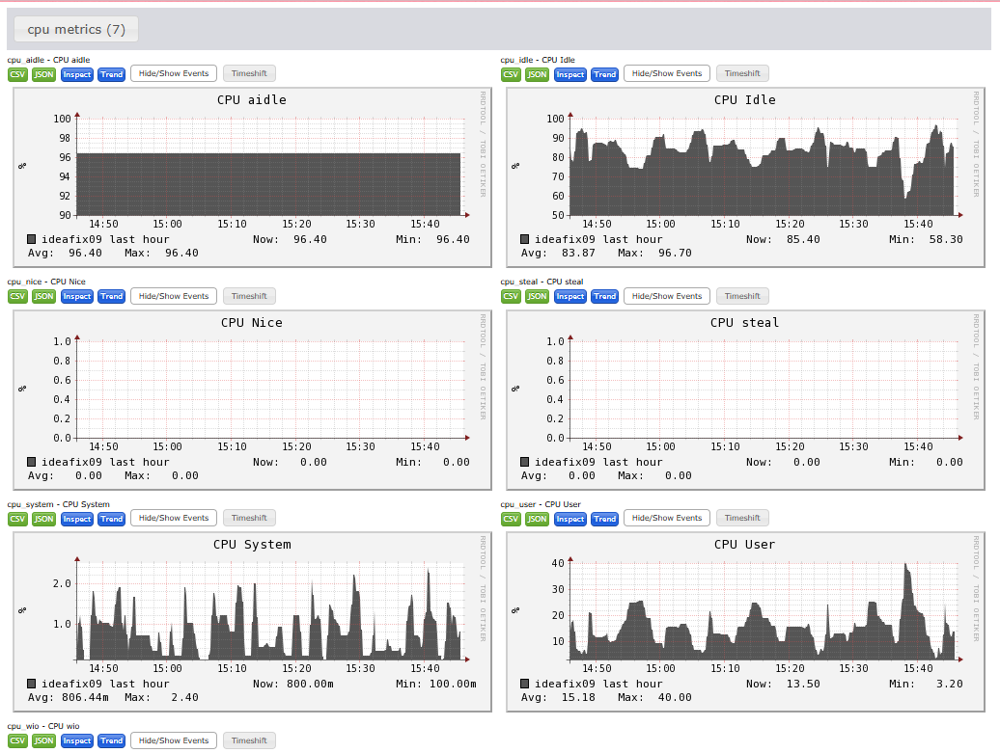
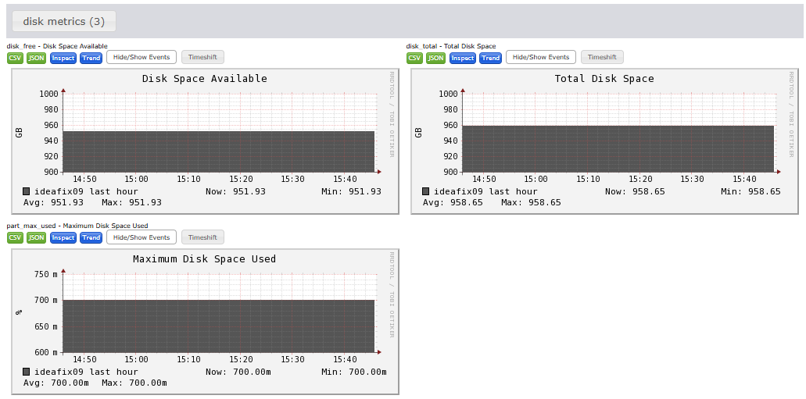
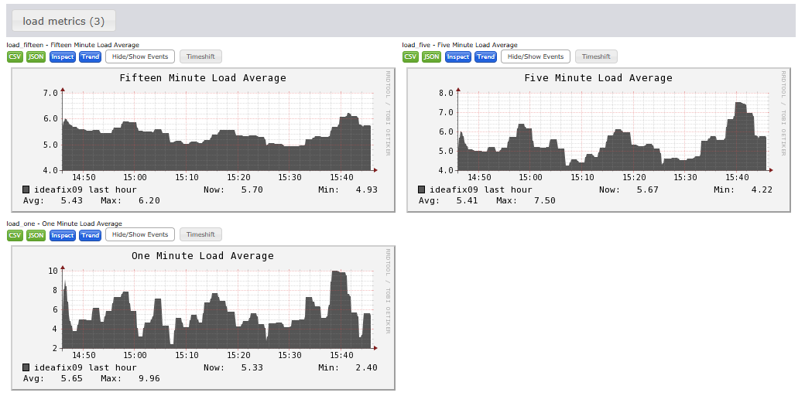
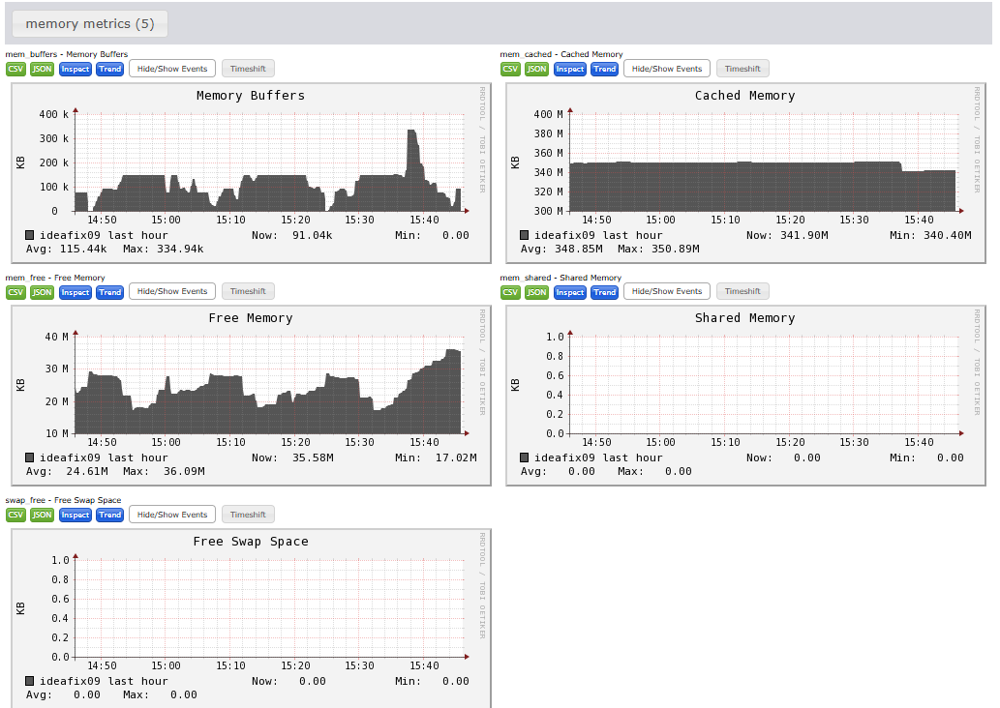

# Curso Práctico de Iniciación al uso del Entorno de Alta Computación

BU-ISCIII

## Práctica 10: Casos Prácticos y Problemas conocidos

- [Curso Práctico de Iniciación al uso del Entorno de Alta Computación](#curso-práctico-de-iniciación-al-uso-del-entorno-de-alta-computación)
  - [Práctica 10: Casos Prácticos y Problemas conocidos](#práctica-10-casos-prácticos-y-problemas-conocidos)
    - [Descripción](#descripción)
    - [Ejercicios](#ejercicios)
      - [1. Reservar más recursos de los disponibles](#1-reservar-más-recursos-de-los-disponibles)
      - [2. Un trabajo utiliza más memoria de la solicitada](#2-un-trabajo-utiliza-más-memoria-de-la-solicitada)
      - [3. Load average](#3-load-average)
      - [4. Ganglia](#4-ganglia)
      - [5. Problemas de espacio](#5-problemas-de-espacio)
      - [6. Permisos de las distintas particiones](#6-permisos-de-las-distintas-particiones)
      - [7. Gestión de ficheros](#7-gestión-de-ficheros)
      - [9. Lanzar un pipeline de Nextflow en un caso real: Ejecución, revisión e interpretación](#9-lanzar-un-pipeline-de-nextflow-en-un-caso-real-ejecución-revisión-e-interpretación)
      - [10. BONUS: Caso práctico: Descarga con nf-core/fetchngs y preprocesamiento con fastp](#10-bonus-caso-práctico-descarga-con-nf-corefetchngs-y-preprocesamiento-con-fastp)

### Descripción

En esta práctica se trabajará con situaciones reales y problemas comunes que pueden aparecer en entornos de computación de alto rendimiento (HPC). El objetivo es aprender a identificar, diagnosticar y resolver incidencias, así como adoptar buenas prácticas en la gestión de recursos y ejecución de trabajos.

### Ejercicios

#### 1. Reservar más recursos de los disponibles

Vamos a intentar reservar más recursos de los disponibles para comprobar cómo el trabajo no entra en cola.

Para ver los recursos límite de los nodos de los que disponemos podemos ejecutar: `sinfo -o "%25N  %10c  %20m  %30G"`:

```bash
NODELIST                                            CPUS        MEMORY                GRES                           
ideafix[01-32]                                      32          385000+               local_scratch:880G
```

Para ver la información de las particiones ejecutamos `sinfo`:

```bash
$ sinfo 
PARTITION  AVAIL  TIMELIMIT  NODES  STATE NODELIST
long_idx      up 10-00:00:0      7  drain ideafix[01,04,08,10-13]
long_idx      up 10-00:00:0      1    mix ideafix16
long_idx      up 10-00:00:0     24   idle ideafix[02-03,05-07,09,14-15,17-32]
middle_idx    up 2-00:00:00      7  drain ideafix[01,04,08,10-13]
middle_idx    up 2-00:00:00      1    mix ideafix16
middle_idx    up 2-00:00:00     24   idle ideafix[02-03,05-07,09,14-15,17-32]
short_idx*    up   12:00:00      7  drain ideafix[01,04,08,10-13]
short_idx*    up   12:00:00      1    mix ideafix16
short_idx*    up   12:00:00     24   idle ideafix[02-03,05-07,09,14-15,17-32]
tmp_idx       up   infinite      7  drain ideafix[01,04,08,10-13]
tmp_idx       up   infinite      1    mix ideafix16
tmp_idx       up   infinite     24   idle ideafix[02-03,05-07,09,14-15,17-32]
```

Podemos ver que tenemos un máximo de 32 cpus y un máximo de memoria de 385000Mb, además tenemos 4 tipos de colas, las long, con un tiempo límite de 10 días, las middle con un tiempo limite de 2 días, las short con un tiempo límite de 12h y las tmp que no tienen tiempo límite.

Para ver el estado de mis trabajos en la cola con información útil:

```bash
squeue -o "%7i %75j %8T %10u %5a %10P %8Q %5D %11l %8M %7C %7m %R"
```

Si lanzamos un trabajo reservando más recursos de los que disponemos ejecutando:

Más CPUs:

```bash
srun --cpus-per-task 33 --output MORE_CPUS.%j.log --job-name MORE_CPUS sleep 1
```

Observamos:

```bash
srun: error: CPU count per node can not be satisfied
srun: error: Unable to allocate resources: Requested node configuration is not available
```

Más memoria:

```bash
# Más memoria
srun --output MORE_MEM.%j.log --mem 3850000M --job-name MORE_MEM sleep 1
```

Observamos:

```bash
srun: error: Memory specification can not be satisfied
srun: error: Unable to allocate resources: Requested node configuration is not available
```

Más tiempo:

```bash
# Más memoria
srun --output MORE_TIME.%j.log --partition short_idx --time 2-00:00:00 --job-name MORE_TIME sleep 1 &
```

Observamos:

```bash
srun: Requested partition configuration not available now
srun: job 4787287 queued and waiting for resources
```

Pero si observamos nuestra cola veremos:

```bash
4787287 MORE_TIME                                                                   PENDING  s.varona   bi    short_idx  17928    1     2-00:00:00  0:00     1       4G      (PartitionTimeLimit)
```

Nos sale `PartitionTimeLimit` y nunca va a ejecutarse. Hay que matar el trabajo con `scancel JOB_ID`. El numero es el JOB_ID del gestor de colas.

Recomendaciones:

- Revisar siempre el numero máximo de recursos disponibles
- Reservar siempre lo que creamos que va a necesitar un proceso:
  - Reservar más recursos hará que tengamos menos prioridad en la cola
  - Reservar menos recursos hará que el proceso se pare y tengamos que volver a empezar

#### 2. Un trabajo utiliza más memoria de la solicitada

Vamos a ejecutar un trabajo que utilice más memoria de la solicitada para observar el comportamiento del sistema.

Ejecutamos:

```bash
srun --partition=short_idx --time=00:05:00 --mem=300M bash -lc 'python3 -c "import time; b=[]; [ (b.append(bytearray(5*1024*1024)), time.sleep(0.1)) for _ in range(200) ]"'
```

Observamos:

```bash
slurmstepd-ideafix03: error: Detected 1 oom_kill event in StepId=4833316.0. Some of the step tasks have been OOM Killed.
srun: error: ideafix03: task 0: Out Of Memory
```

Recomendaciones:

- Revisar siempre el numero máximo de recursos disponibles
- Reservar siempre lo que creamos que va a necesitar un proceso:
  - Reservar más recursos hará que tengamos menos prioridad en la cola
  - Reservar menos recursos hará que el proceso se pare y tengamos que volver a empezar

#### 3. Load average

Vamos a simular un **load average** elevado y analizar su impacto.

Ejecutamos:

```bash
# Reserva 4 CPUs pero lanza 24 procesos CPU-bound
# Nota: mantén N <= 32 para no saturar el nodo
srun --partition=short_idx --time=00:03:00 -c 4 --chdir="$HOME" --pty bash -lc '
  echo "CPUs reservadas: $SLURM_CPUS_PER_TASK"
  echo $(hostname)
  N=16
  # Lanzamos N procesos que consumen CPU
  for i in $(seq 1 $N); do yes > /dev/null & done
  # Observamos la carga durante ~90s para que suba el promedio de 1 min
  for i in {1..90}; do uptime; sleep 5; done
  # Limpiamos solo los hijos creados en este shell
  pkill -P $$ yes || true
'
```

Observamos:

```bash
# Salida orientativa de uptime (puede variar)
 14:22:17 up 10 days,  2:03,  1 user,  load average: 6.10, 3.00, 1.50
 14:22:47 up 10 days,  2:03,  1 user,  load average: 12.30, 5.80, 2.20
 14:23:17 up 10 days,  2:04,  1 user,  load average: 18.00, 9.00, 3.90
```

- Además podemos entrar al nodo de cómputo para ver el `load-average` y cómo se están ejecutando en `htop`

```bash
srun --partition=short_idx --nodelist=NODO_DE_COMPUTO --cpus-per-task=2 --mem=2G --time=00:30:00 --pty bash
```

Veríamos algo así:


Recomendaciones:

- Ajustar `--cpus-per-task (-c)` al paralelismo real del trabajo.
- Evitar oversubscription: no lanzar más hilos/procesos de los CPUs reservados.
- En OpenMP, alinear `OMP_NUM_THREADS=$SLURM_CPUS_PER_TASK`.
- En MPI/Multithread, revisar mapeo/afinidad (p. ej. `--cpu-bind`, `--hint=nomultithread`).
- Si el `load average` sostenido supera los cores del nodo (p. ej. > 32), el nodo puede pasar a estado no disponible/`drain` por las políticas de salud. Avisar a soporte si ocurre.

Nota: el `load average` es un promedio exponencial (1/5/15 min). El valor de 1 minuto tarda decenas de segundos en reflejarse; por eso alargamos la observación a ~90s. Si necesitas superar 4 antes, incrementa `N` (siempre ≤ 32) o prolonga el tiempo de observación.

#### 4. Ganglia

Vamos a ver como se puede emplear [**Ganglia**](http://ganglia.isciii.es/) como herramienta de diagnóstico y monitorización. Ganglia es una herramienta de monitorización y diagnóstico de sistemas, muy usada en entornos de HPC (High Performance Computing) y clústeres. Ganglia recopila métricas de cada nodo del clúster como: Uso de CPU, memoria, red, carga del sistema (load average), espacio en disco, y otras métricas personalizadas. Se visualiza a través de una interfaz web con gráficos históricos y en tiempo real. Para qué sirve:

- Detectar sobrecarga en un nodo.
- Ver tendencias de consumo de recursos.
- Diagnosticar cuellos de botella.
- Comprobar si los trabajos se están ejecutando correctamente o si saturan el sistema.

Dentro de Ganglia podemos seleccionar el cluster que queremos monitorizar, en este caso seleccionamos XTutatis del desplegable `Cluster > Xtutatis`.

Observamos los siguientes gráficos:

**XTutatis aggregated load_one last hour**



**XTutatis load_one last hour by node**



You can select a node and see more information:

**CPU metrics**



**Disk metrics**



**Load metrics**



**Memory metrics**



#### 5. Problemas de espacio

En ocasiones cuando estemos trabajando en el HPC podemos observar este error `No space left on device`. Este se debe a que el espacio de alguna de las particiones que estamos empleando está llena. Vamos a revisar el tamaño de las particiones para gestionar el almacenamiento de forma eficiente.

Ejecutamos:

```bash
df -h
```

Observamos:

```bash
Filesystem                          Size  Used Avail Use% Mounted on
tmpfs                                16G  4.4G   12G  29% /
devtmpfs                             16G     0   16G   0% /dev
tmpfs                                16G  571M   15G   4% /dev/shm
tmpfs                                16G  746M   15G   5% /run
tmpfs                                16G     0   16G   0% /sys/fs/cgroup
IP:/HPC_UI_ACTIVE                    60T   54T  6.7T  89% /data
IP:/HPC_Home                        200G  149G   52G  75% /home
IP:/HPC_UCCT_BI_ACTIVE               30T   19T   12T  62% /data/courses/hpc_course
IP:/HPC_Scratch                     7.4T  7.4T  0.0T 100% /scratch
//IP7/hpc-bioinfo/                  1.0T  713G  312G  70% /data/courses/hpc_course/sftp
IP:/HPC_Soft                        350G  295G   56G  85% /soft
IP:/HPC_UCCT_ME_ARCHIVED             42T   38T  4.2T  91% /archived/ucct/me
IP:/HPC_UCCT_BI_ARCHIVED             50T   37T   14T  74% /archived/ucct/bi
IP:/HPC_Opt                         100G   15G   86G  15% /opt
IP:/NGS_Data_FastQ_Active            15T  8.0T  7.1T  54% /srv/fastq_repo
//IP7/hpc-genvigies/                1.0T  436G  589G  43% /sftp/genvigies
```

Aquí podemos ver que el uso de `/scratch` es del 100% y que no queda espacio libre en la memoria. `/scratch` tiene 7Tb de memoria para compartir entre todos los usuarios del HPC. No es una unidad de almacenamiento sino una unidad de cómputo, por lo que no debe permanecer nada ahí que no se vaya a computar a corto plazo (24 horas) ya que el almacenamiento es limitado.

En estos casos habría que observar qué carpetas son las que más especio ocupan para borrarlas lo antes posible. Esto se realiza con el siguiente comando:

```bash
du -sh ./*
```

Observamos:

```bash
4.0K    ./00-reads
81G     ./20250728_ANALYSIS02_METAGENOMIC_HUMAN
78G     ./20250728_ANALYSIS05_TAXPROFILER
4.0K    ./lablog_taxprofiler
40K     ./lablog_viralrecon
0       ./samples_id.txt
0       ./samples_ref.txt
```

La primera columna es el espacio (en K, M o G) que ocupa un archivo o carpeta y la segunda es el nombre del archivo o carpeta. Es este ejemplo concreto tendríamos que revisar las carpetas `./20250728_ANALYSIS02_METAGENOMIC_HUMAN` y `./20250728_ANALYSIS05_TAXPROFILER` para ver si alguno de los archivos que tienen dentro se puede borrar. Esto solo en el caso de que siga necesitando computar con estos archivos; si no, habría que copiar la carpeta a una unidad de almacenamiento a largo plazo y borrarlo de `/scratch/hpc_course`.

Recomendaciones:

- Siempre que hayamos terminado un análisis, eliminar las carpetas temporales (work, tmp...)
- Evitar almacenar archivos grandes redundantes (.bam, .sorted.bam, .sorted.trimmed.bam...)
- Siempre que hayamos terminado con una carpeta, copiarla a una unidad de almacenamiento a largo plazo.

#### 6. Permisos de las distintas particiones

El área `/scratch` está pensada para E/S rápida en los nodos de cómputo. En muchos clústeres se monta como solo lectura en el nodo de acceso (login), por lo que desde login no podrás crear archivos bajo `/scratch`. Sin embargo, una vez dentro de un nodo de cómputo, sí podrás escribir en tu subcarpeta de trabajo (por ejemplo `/scratch/hpc_course`).

Comprobemos ambos casos usando la ruta `/scratch/hpc_course`:

1. Intento de escritura desde el nodo de acceso (login):

```bash
cd /scratch/hpc_course
touch test_file.txt
```

Observamos un error (solo lectura o permisos):

```bash
touch: cannot touch 'test_file.txt': Read-only file system
```

2. Escritura desde un nodo de cómputo (sesión interactiva):

```bash
srun --partition=short_idx --cpus-per-task=2 --mem=2G --time=00:30:00 --pty bash
hostname
cd /scratch/hpc_course
touch test_file_${USER}.txt
ls -l test_file_${USER}.txt
```

Observamos que ahora el fichero se crea correctamente en el nodo de cómputo. Para dejarlo limpio, podemos borrar el fichero y salir:

```bash
rm -f /scratch/hpc_course/test_file_${USER}.txt
exit
```

Recomendaciones:

- Trabajar en `/scratch` solo desde nodos de cómputo (interactivos o de jobs).
- Si lanzas trabajos por lotes, usa `--chdir /scratch/hpc_course` y rutas absolutas o relativas a esa carpeta.
- No uses `/scratch` como almacenamiento a largo plazo; limpia archivos temporales al terminar.

#### 7. Gestión de ficheros

En este ejercicio vamos a crear scripts y alias reutilizables para trabajar de forma cómoda y segura con `/scratch/hpc_course` y `/data/courses/hpc_course`.

Scripts y alias propuestos (guardar en `~/bin` o añadir a `~/.bashrc`):

- Script `hpc_cp.sh`: copiar entre scratch y data con rsync (vía srun)

  Usa el script proporcionado en este enlace: <a href="./hpc_cp.sh" target="_blank">exercises/09_usecase_issues/hpc_cp.sh</a>.

  Cópialo al nodo de acceso como `~/bin/hpc_cp.sh` y dale permisos: `chmod +x ~/bin/hpc_cp.sh`. P.e desde tu máquina local donde tengas los scripts:
  
  ```bash
  scp -P 32122 *.sh profesor00@portutatis.isciii.es:/home/hpc_course/profesor00/bin
  ```

  Uso:

  ```bash
  hpc_cp.sh [scratch->data|data->scratch] <ruta_relativa> [--dry-run] \
            [--data-base /data/courses/hpc_course] \
            [--scratch-base /scratch/hpc_course]
  ```

  Notas:
  - Ejecuta `rsync` mediante `srun` en un nodo de cómputo (respeta políticas de scratch).
  - Crea el directorio destino en el nodo de cómputo antes de sincronizar.
  - Los mensajes del script están en inglés.

  Ejemplos:
  - `hpc_cp.sh "scratch->data" 20250929_HPC-COURSE_profesor00/` copia `/scratch/hpc_course/20250929_HPC-COURSE_profesor00/` a `/data/courses/hpc_course/20250929_HPC-COURSE_profesor00/`.
  - `hpc_cp.sh "data->scratch" 20250929_HPC-COURSE_profesor00/ --dry-run` simula copiar `/data/courses/hpc_course/20250929_HPC-COURSE_profesor00/` a `/scratch/hpc_course/20250929_HPC-COURSE_profesor00/`.

- Alias para colas: `sq` (squeue) y `si` (sinfo)

  Añadir al final de `~/.bashrc` y recargar con `source ~/.bashrc`:

  ```bash
  # Formatos "completos" usados en la práctica
  alias sq='squeue -o "%7i %75j %8T %10u %5a %10P %8Q %5D %11l %8M %7C %7m %R" -u $USER'
  alias si='sinfo  -o "%20P %5D %14F %8z %10m %10d %11l %16f %N"'
  ```

- Función `scratch()`: abre sesión interactiva ya colocada en `/scratch/hpc_course`

  Añadir al final de `~/.bashrc` y recargar con `source ~/.bashrc`:

  ```bash
  scratch() {
    srun --partition=short_idx \
         --time=00:30:00 \
         --cpus-per-task=2 \
         --mem=4G \
         --chdir /scratch/hpc_course \
         --pty bash -l
  }
  ```

- Script `cleanup_scratch.sh`: limpieza segura con dos modos

  - Modo `temps`: busca temporales (p. ej. `work*`, `tmp*`, `.nextflow*`) antiguos.
  - Modo `stale`: busca carpetas de primer nivel en `BASE` sin modificación reciente.

  Por defecto solo muestra lo que borraría (modo "dry-run"). Para ejecutar el borrado, añade `--force`.

  Coger el script de la carpeta de la práctica <a href="./cleanup_scratch.sh" target="_blank">cleanup_scratch.sh</a> y guardar en el nodo de acceso como `~/bin/cleanup_scratch.sh` y dar permisos: `chmod +x ~/bin/cleanup_scratch.sh`.

  Para probarlo podemos crear una carpeta falseando su fecha de modificación, y dentro crear una carpeta temporal y una de resultados:

  ```bash
  scratch
  mkdir -p TEST_FOLDER_${USER}/work
  ```

  El modo `temps` no aplica filtro de antigüedad, por lo que detectará inmediatamente la carpeta `work`. Si además queremos generar un caso para el modo `stale`, podemos envejecer la carpeta completa:

  ```bash
  touch -d '3 days ago' TEST_FOLDER_${USER}
  ```

  Con ello `stale` mostrará el directorio principal como candidato por tener más de 2 días sin actividad.

  ```bash
  cleanup_scratch.sh -m temps
  cleanup_scratch.sh -m stale
  cleanup_scratch.sh -m stale -f
  ```

- Plantilla mínima de job SLURM (batch)

  Guardar como `job.slurm` en tu proyecto y ajustar recursos según necesidad.

  ```bash
  #!/usr/bin/env bash
  #SBATCH --job-name=EJEMPLO
  #SBATCH --partition=short_idx
  #SBATCH --time=00:30:00
  #SBATCH --cpus-per-task=2
  #SBATCH --mem=4G
  #SBATCH --chdir=/scratch/hpc_course
  #SBATCH --output=logs/%x.%j.log

  set -euo pipefail
  mkdir -p logs
  echo "Nodo: $(hostname)"; date

  # Cargar módulos si procede
  # module load singularity

  # Trabajo principal
  srun bash -lc 'echo "Hola SLURM"; sleep 10'
  ```

Recomendaciones:

- Usar rutas consistentes entre scratch y data para facilitar sincronización.
- Mantener `logs/` en data y solo temporales/pesados en scratch.
- Automatizar con `rsync` y revisar siempre en modo `--dry-run` antes de borrar.

#### 9. Lanzar un pipeline de Nextflow en un caso real: Ejecución, revisión e interpretación

Vamos a hacer un análisis real de un workflow en bioinformática automatizado con Nextflow y listo para ser utilizado en la infraestructura HPC. Este pipeline se llama [nf-core/bacass](https://nf-co.re/bacass/2.4.0), y realiza un control de calidad, ensamblado y anotación de genomas con multitud de herramientas.

- Crear la carpeta de trabajo
- Preparar los archivos necesarios
- Ejecutar el pipeline
- Revisar los logs y resultados
- Revisar la carpeta `work`

1. Quickstart con perfil de testing (sin samplesheet)

nf-core/bacass incluye un perfil de testing (`-profile test`) que trae datos de prueba y parámetros mínimos preconfigurados dentro del propio pipeline. Con este perfil NO necesitas pasar `--input` ni otros parámetros de entrada; es ideal para verificar que Nextflow está bien configurado en tu cuenta.

- Nos movemos a la carpeta de trabajo del curso

```bash
cd /data/courses/hpc_course/*HPC-COURSE_${USER}/ANALYSIS
mkdir -p 09-use-cases/logs
cd 09-use-cases
```

- Script sbatch de ejemplo (solo controlador; las tareas pesadas las lanza Nextflow a Slurm). Crea un script `bacass_test.sbatch` y copia el contenido:

```bash
#!/bin/bash
#SBATCH --job-name=nf_bacass_test
#SBATCH --chdir=/scratch/hpc_course/XXXXX_HPC-COURSE_${USER}/ANALYSIS/09-use-cases -> CAMBIAR POR RUTA COMPLETA SEGUN TU USUARIO Y FECHA
#SBATCH --partition=short_idx
#SBATCH --time=12:00:00
#SBATCH --cpus-per-task=1
#SBATCH --mem=2G
#SBATCH --output=logs/%x-%j.logs

# You need to modify the --chdir above to point to your ANALYSIS directory
module purge
module load Nextflow/24.04.2
module load singularity

mkdir -p 01-nextflow-bacass-results-test
nextflow run nf-core/bacass \
  -r 2.4.0 \
  -profile test,singularity \
  -c nextflow.config \
  --outdir 01-nextflow-bacass-results-test \
  -resume
```

> El perfil `test` trae un dataset diminuto embebido en el pipeline (o referenciado desde su repositorio) y valores por defecto adecuados para comprobar que todo funciona en Slurm.

- Recordad copiar el fichero <a href="../08_handson_scientific_workflows_nextflow/nextflow.config" target="_blank">`nextflow.config`</a> de la práctica anterior y copiarlo en el directorio de trabajo.

- Sincronizamos a `/scratch`

```bash
cd /data/courses/hpc_course/
bash ~/bin/hpc_cp.sh "data->scratch" <DATE>HPC-COURSE_<USER>
```

- Nos movemos a scratch y lanzamos el trabajo.

```bash
# Lo hemos configurado antes en nuestro bashrc
scratch
cd /scratch/hpc_course/*HPC-COURSE_${USER}/ANALYSIS/09-use-cases
mkdir -p logs
sbatch ./bacass_test.sbatch
```

- Comprobamos el estado del trabajo, los logs y los output para comprobar si ha fallado o no. Si ha fallado interpretamos los logs para ver el problema. Si ni siquiera aparecen logs, todo apunta a un error de paths en chdir o en el path a los logs. O que no esté copiado correctamente a scratch.

2. Crear `samplesheet.csv` (tus propios datos)

Si quieres ejecutar el pipeline con tus datos, bacass espera un `samplesheet.csv` con esta estructura mínima (una muestra por fila):

```bash
cat > samplesheet.csv <<'CSV'
ID,R1,R2,LongFastQ,Fast5,GenomeSize
Sample01,/scratch/hpc_course/*HPC-COURSE_${USER}/ANALYSIS/00-reads/sample01_R1.fastq.gz,/scratch/hpc_course/*HPC-COURSE_${USER}/ANALYSIS/00-reads/sample01_R2.fastq.gz,NA,NA,NA
Sample02,/scratch/hpc_course/*HPC-COURSE_${USER}/ANALYSIS/00-reads/sample02_R1.fastq.gz,/scratch/hpc_course/*HPC-COURSE_${USER}/ANALYSIS/00-reads/sample02_R2.fastq.gz,NA,NA,NA
CSV
```

> Cada fila muestra la información de una muestra.

3. Generar `samplesheet.csv` a partir de `samples_id.txt` y `00-reads/`

Durante una sesión previa hemos generado `ANALYSIS/samples_id.txt` (una ID por línea) y has dejado los FASTQ en `ANALYSIS/00-reads/` con el patrón `<ID>_R1.fastq.gz` y `<ID>_R2.fastq.gz`, puedes crear el `samplesheet.csv` automáticamente:

```bash
# Muevete a un nodo de computo a scratch
scratch
cd /scratch/hpc_course/*HPC-COURSE_${USER}/ANALYSIS/09-use-cases
# Crea el fichero samplesheet.csv
awk -v R="/scratch/hpc_course/*HPC-COURSE_${USER}/ANALYSIS/00-reads" \
  'BEGIN{print "ID,R1,R2,LongFastQ,Fast5,GenomeSize"} \
   {printf "%s,%s/%s_R1.fastq.gz,%s/%s_R2.fastq.gz,NA,NA,NA\n", $0,R,$0,R,$0}' \
  /scratch/hpc_course/*HPC-COURSE_${USER}/ANALYSIS/samples_id.txt > samplesheet.csv
```

> Comprueba que todos los ficheros existen (`ls -1 /scratch/.../00-reads/<ID>_R[12].fastq.gz`). Si alguna muestra no tiene R2 (lecturas simples), ajusta la línea correspondiente dejando `R2` vacío o consulta la documentación del pipeline para el formato single-end.

- Reutiliza `nextflow.config` y lanza bacass con tu samplesheet

Crea el script sbatch master que controlará la ejecución de nextflow. Llamaremos a este script `nextflow_bacass.sbatch`.

```bash
#!/bin/bash
#SBATCH --job-name=nf_bacass
#SBATCH --chdir=/scratch/hpc_course/*HPC-COURSE_${USER}/ANALYSIS/09-use-cases
#SBATCH --partition=short_idx
#SBATCH --time=12:00:00
#SBATCH --cpus-per-task=1
#SBATCH --mem=2G
#SBATCH --output=logs/%x-%j.logs

# Tienes que ajustar --chdir para que apunte a tu ANALYSIS en la configuración de arriba
module purge
module load Nextflow/24.04.2
module load singularity

mkdir -p 02-nextflow-bacass-results
nextflow run nf-core/bacass \
  -r 2.4.0 \
  -profile test,singularity \
  -c nextflow.config \
  --input samplesheet.csv \
  --outdir 02-nextflow-bacass-results \
  -resume
```

> **Tip**: muchos pipelines nf-core aceptan `--input` (o `--samplesheet` según release). Verifica con `-help`.

**Monitorea:**

```bash
squeue --me -o "%.18i %.10P %.40j %.2t %.10M %.6D %R"
tail -f logs/nf_bacass-<JOBID>.out
```

**Salidas esperables:**

- `02-nextflow-bacass-results/` con ensamblados, anotación y **MultiQC**.
- `02-nextflow-bacass-results/pipeline_info/`.

**PREGUNTAS:**

- Explora `02-nextflow-bacass-results/pipeline_info/`: ¿qué **etapa** fue la más lenta?
- Vuelve a lanzar con `-resume`: ¿qué etapas **se saltan** y cuáles se re-ejecutan?

5. Ajustar recursos “por proceso” (sin tocar el pipeline)

Puedes subir/bajar recursos con **`withName:`** en `nextflow.config` sin editar el pipeline:

```groovy
process {
  withName: FASTQC {
    cpus   = 2
    memory = '3 GB'
    time   = '30m'
  }
  withName: SPADES {
    cpus   = 8
    memory = '64 GB'
    time   = '12h'
  }
}
```

#### 10. BONUS: Caso práctico: Descarga con nf-core/fetchngs y preprocesamiento con fastp

Objetivo: descargar tres runs SRA con `nf-core/fetchngs` (ERR2261314, ERR2261315, ERR2261318) dentro de `RAW/`, preparar `00-reads/` y ejecutar `fstp` usando solo Singularity.

1. Preparación: nf-core/tools (micromamba) y contenedores en tu $HOME

```bash
# Directorios en tu $HOME para código y contenedores
mkdir -p "$HOME/software/nfcore" "$HOME/containers/singularity"

# Crea un entorno con micromamba para nf-core/tools
# (ver práctica de Software Management para instalar/activar micromamba)
micromamba create -y -n nf-core python=3.10 pip
micromamba activate nf-core
python -m pip install --upgrade pip
pip install --upgrade nf-core

# Exporta la caché de imágenes Singularity para Nextflow y persístela en tu ~/.bashrc
export NXF_SINGULARITY_CACHEDIR="$HOME/containers/singularity"
grep -q NXF_SINGULARITY_CACHEDIR ~/.bashrc || echo 'export NXF_SINGULARITY_CACHEDIR="$HOME/containers/singularity"' >> ~/.bashrc

# Descarga previa de pipelines y sus imágenes Singularity con nf-core/tools (dentro del entorno nf-core)
# (ajusta la revisión -r a la versión estable disponible en tu entorno)
# Puedes usar el entorno activo o llamar con micromamba run como se muestra:
micromamba activate nf-core
module load Nextflow singularity
nf-core pipelines download nf-core/fetchngs \
  -r 1.12.0 \
  --container-system singularity \
  --container-cache-utilisation amend \
  --compress none \
  --force \
  --outdir "$HOME/software/nfcore/fetchngs"
```

1. Estructura de carpetas del proyecto

```bash
# Ruta base del ejercicio
cd /data/courses/hpc_course/
BASE="$(date +%Y%m%d)_HPC-COURSE-FASTP_${USER}"
mkdir $BASE
mkdir -p "$BASE"/{RAW,ANALYSIS,TMP,RESULTS,DOC,REFERENCES}
mkdir -p "$BASE/RAW/logs"
# Subestructura de análisis
mkdir -p "$BASE/ANALYSIS"/{00-reads,01-fastp,logs}
cd "$BASE/RAW"
```

2. Preparar IDs y consultar documentación

- Documentación: lee los parámetros en <https://github.com/nf-core/fetchngs> (rama estable/dev según disponibilidad).
- Crea un fichero con los IDs SRA (uno por línea):

```bash
cat > sra_ids.csv << 'EOF'
ERR2261314
ERR2261315
ERR2261318
EOF
```

1. Copia o genera el fichero `nextflow.config` en la carpeta `DOC`.

```bash
// El gestor de paquetes que usaremos será Singularity:
singularity {
  enabled    = true
  autoMounts = true
}

process {
  executor      = 'slurm'      // Con este parámetro hacemos saber a Nextflow que ejecutará en Slurm
  queue         = 'short_idx'  // Indica el nombre de la cola
  cpus          = 1            // CPUs por tarea
  memory        = '2 GB'       // Memoria por tarea
  time          = '1h'        // Límite por tarea
  jobName       = { "${task.process} (${task.name})" }  // Nombre legible en la cola    
  errorStrategy = { task.exitStatus in [140,143,137,138,104,134,139] ? 'retry' : 'finish' }
  maxRetries    = 1
  maxErrors     = -1
  // Opcional: restringe nodos o añade flags del clúster
  // clusterOptions = '--nodelist=ideafix[01-10]'
}
```

4. Descargar datos con nf-core/fetchngs (a RAW/) via sbatch

```bash
cat > fetchngs.sbatch << "SLURM"
#!/usr/bin/env bash
#SBATCH --job-name=fetchngs
#SBATCH --chdir="/scratch/hpc_course/$(date +%Y%m%d)_HPC-COURSE-FASTP_${USER}/RAW" -> CAMBIAR POR RUTA COMPLETA SIN VARIABLES
#SBATCH --partition=short_idx
#SBATCH --time=04:00:00
#SBATCH --cpus-per-task=2
#SBATCH --mem=4G
#SBATCH --output=logs/logs_%x-%j.log

set -euo pipefail
module purge
module load Nextflow/24.04.2
module load singularity

# Usa caché de imágenes en $HOME
export NXF_SINGULARITY_CACHEDIR="$HOME/containers/singularity"

# Ejecuta el pipeline descargado en $HOME/software/nfcore/fetchngs
nextflow run "$HOME/software/nfcore/fetchngs/1_12_0/main.nf" \
  -profile singularity \
  -c ../DOC/nextflow.config \
  --input sra_ids.csv \
  --download_method sratools \
  --outdir "." -> CAMBIAR POR RUTA COMPLETA SIN VARIABLES" \
  -resume
SLURM
```

4. Copiamos a scratch

```bash
hpc_cp.sh "data->scratch" XXXXXXX_HPC-COURSE-FASTP_${USER}
```

5. Lanzamos el pipeline

```bash
scratch
cd *_HPC-COURSE-FASTP_${USER}/RAW
sbatch fetchngs.sbatch
```

Realiza la monitorización del job y vigila los logs. Cuando termine, verifica que en `RAW/` tienes los FASTQ descargados y el `samplesheet.csv` generado por fetchngs (si aplica a tu versión), que te puede servir de referencia.

1. Preparar `ANALYSIS/00-reads/`

- Copia o enlaza los FASTQ de `RAW/` a `ANALYSIS/00-reads/` (ajusta patrones si tus ficheros difieren):

```bash
cd $(date +%Y%m%d)_HPC-COURSE-FASTP_${USER}/ANALYSIS/00-reads
cat ../samples_id.txt | xargs -I % echo "ln -s ../../RAW/fastq/*_%_1.fastq.gz %_R1.fastq.gz" | bash
cat ../samples_id.txt | xargs -I % echo "ln -s ../../RAW/fastq/*_%_2.fastq.gz %_R2.fastq.gz" | bash
```

- Crea un `samples_id.txt`:

```bash
cd "*_HPC-COURSE-FASTP_${USER}/ANALYSIS"
cat > samples_id.txt << 'EOF'
ERR2261314
ERR2261315
ERR2261318
EOF

```

1. Crear un script de sbatch para ejecutar fastp en la carpeta 01-fastp. Utiliza la imagen de singularity que te descargaste en la pŕactica 6.

2. Comprobaciones y resultados

- Monitoriza los jobs: `squeue --me -o "%.18i %.40j %.2t %.10M %R"`
- Revisa logs.
